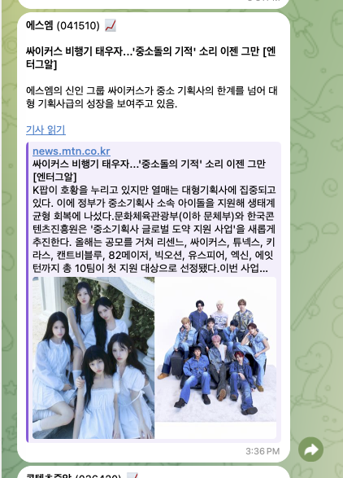
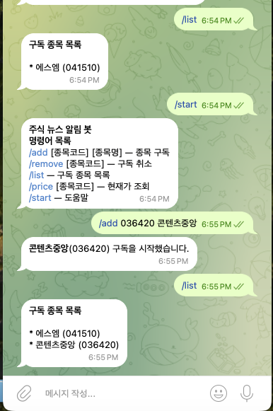
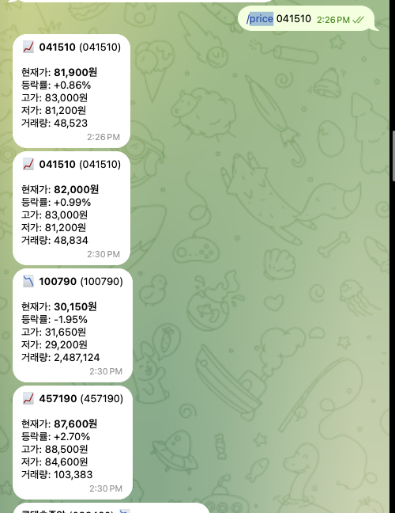

# Stock News Bot


- 구독한 종목의 뉴스를 AI로 요약해 텔레그램으로 전송하고
- DART 공시·시세·급변동 알림을 제공하는 Spring Boot 기반 텔레그램 봇 

---

## 주요 기능

| 기능 | 상태 |
|---|---|
| 텔레그램 봇 명령어 처리 (`/add`, `/remove`, `/list`, `/price`) | 완료 |
| 네이버 검색 API 기반 종목 뉴스 수집 및 발송 | 완료 |
| TF-IDF 코사인 유사도 기반 유사 뉴스 중복 제거 | 완료 |
| Gemini → Claude AI 뉴스 요약 및 영향도 분석 | 완료 |
| 한국투자증권 KIS API 현재가 조회 및 정기 시세 발송 | 완료 |
| 급변동 알림 (기준가 대비 ±N%) | 완료 |
| 금융감독원 DART 공시 알림 | 완료 |
| Discord Webhook 에러 알림 | 완료 |
| Docker 컨테이너 배포 | 완료 |
| 웹 UI (발송 이력, 구독 현황, 로그 조회) | 개발 중 |

---

## 기술 스택

- **Language**: Java 21 (Virtual Thread)
- **Framework**: Spring Boot 4.1.0 (Spring Framework 7, Jakarta EE 11)
- **Build**: Gradle 8.14+ (Groovy DSL)
- **DB**: SQLite (Hibernate Community Dialects)
- **HTTP**: Spring RestClient
- **Infra**: Docker (멀티스테이지 빌드), Docker Compose
- **CI**: GitHub Actions

### 외부 API

| API | 용도                       |
|---|--------------------------|
| Telegram Bot API | Long-polling 기반 봇 통신     |
| 네이버 검색 API | 종목 뉴스 수집                 |
| Google Gemini API | 뉴스 요약 및 영향도 분석 (1차)      |
| Anthropic Claude API | 뉴스 요약 및 영향도 분석 (2차 fallback) |
| 한국투자증권 KIS API | 현재가 시세 조회                |
| 금융감독원 OpenDART API | 공시 수집                    |
| Discord Webhook | 에러 알림                   |

---

## 시작하기

### 사전 요구사항

- Java 21 또는 Docker
- 아래 외부 서비스 API 키

### 환경변수 설정

`.env.example`을 복사해서 `.env`를 만들고 실제 값을 입력.

```bash
cp .env.example .env
```

```env
# 텔레그램 봇 토큰 (@BotFather 에서 발급)
TELEGRAM_TOKEN=

# 네이버 검색 API (https://developers.naver.com)
NAVER_CLIENT_ID=
NAVER_CLIENT_SECRET=

# Google Gemini API — 무료 플랜으로 1차 사용 (https://aistudio.google.com)
GEMINI_API_KEY=

# Anthropic Claude API — Gemini 실패 시 fallback (https://console.anthropic.com)
CLAUDE_API_KEY=

# 한국투자증권 KIS API (https://apiportal.koreainvestment.com)
KIS_APP_KEY=
KIS_APP_SECRET=

# 금융감독원 OpenDART API (https://opendart.fss.or.kr)
DART_API_KEY=

# Discord Webhook 에러 알림 (선택사항)
DISCORD_WEBHOOK_URL=
```

### 로컬 실행

```bash
SPRING_PROFILES_ACTIVE=local ./gradlew bootRun
```

### Docker 실행

```bash
docker compose up --build
```

### 헬스체크

```bash
curl http://localhost:8080/actuator/health
# {"status":"UP"}
```

---

## 텔레그램 봇 명령어

| 명령어 | 설명 | 예시 |
|---|---|---|
| `/add [종목코드] [종목명]` | 종목 구독 | `/add 041510 에스엠` |
| `/remove [종목코드]` | 구독 취소 | `/remove 041510` |
| `/list` | 구독 종목 목록 조회 | `/list` |
| `/price [종목코드]` | 현재가 즉시 조회 | `/price 041510` |
| `/start` | 도움말 | `/start` |

---

## Webhook 모드 설정 (선택사항)

- 기본값은 Long-polling이며, `TELEGRAM_WEBHOOK_URL` 환경변수를 설정하면 자동으로 Webhook 모드로 전환됨
- Polling 을 많이 하다보니 텔레그램 서버에서 IP 를 차단해버리는 상황이 발생하여 Webhook 을 추가하게 되었음

### 로컬 환경에서 Webhook 테스트 (ngrok 사용)

```bash
# 1. ngrok으로 로컬 8080 포트를 HTTPS로 터널링
ngrok http 8080

# 2. 발급된 주소 확인 (예시)
# Forwarding   https://xxxx-xx-xx-xxx-xx.ngrok-free.app -> http://localhost:8080
```

### 환경변수 설정

```env
TELEGRAM_WEBHOOK_URL=https://xxxx-xx-xx-xxx-xx.ngrok-free.app/webhook/telegram
TELEGRAM_WEBHOOK_SECRET_TOKEN=임의의_랜덤_문자열
```

### 텔레그램에 Webhook 등록

```bash
curl -X POST "https://api.telegram.org/bot${TELEGRAM_TOKEN}/setWebhook" \
  -d "url=https://xxxx-xx-xx-xxx-xx.ngrok-free.app/webhook/telegram" \
  -d "secret_token=${TELEGRAM_WEBHOOK_SECRET_TOKEN}"
```

### 등록 상태 확인

```bash
curl "https://api.telegram.org/bot${TELEGRAM_TOKEN}/getWebhookInfo"
```

### Long-polling으로 되돌리기

```bash
curl "https://api.telegram.org/bot${TELEGRAM_TOKEN}/deleteWebhook"
```

- `TELEGRAM_WEBHOOK_URL`을 비우고 재시작하면 Long-polling으로 자동 전환됨
- deleteWebhook 을 꼭 하지는 않아도 됨

> ngrok 무료 플랜은 재시작마다 URL이 바뀌므로, 재시작 시 Webhook을 다시 등록해야 함 
> 텔레그램은 Webhook URL에 `https`와 `443, 80, 88, 8443` 포트만 허용함

---

## 아키텍처 특징

**Long-polling 방식 채택**
- Webhook은 공인 IP/도메인이 필요하지만, Long-polling은 로컬 환경에서도 동작하며 로컬 개발 편의를 위해 Long-polling 채택
- Java 21 Virtual Thread를 활용해 블로킹 I/O 비용을 최소화

**2단계 중복 뉴스 필터링**
- 1단계로 뉴스 URL을 SHA-256으로 해시해서 `sent_news` 테이블에 저장하고, 2단계로 TF-IDF 코사인 유사도를 계산해서 유사도 0.7 이상인 뉴스는 대표 1건만 발송. 재시작 후에도 이미 발송한 뉴스는 다시 보내지 않음.

**Gemini 먼저 사용 후 실패 시 Claude Fallback AI 구조**
- Google Gemini를 1차로 사용함. 
- Gemini는 무료 플랜이 제공되어 비용 효율적. 
- Gemini 호출이 실패하거나 유효하지 않은 응답을 반환하면 자동으로 Claude로 fallback. 
- `AiClient` 인터페이스를 통해 `NewsService`는 어떤 AI가 사용되는지 알 필요 없음.

**Spring Profile 기반 환경 분리**
- `local` 프로파일은 `show-sql: true`, DEBUG 로그를 활성화해서 개발 편의를 높이고, `prod` 프로파일은 `show-sql: false`, INFO 로그로 운영 환경에 최적화.

**Discord Webhook 에러 알림**
- 스케줄러의 모든 작업(뉴스 폴링, 공시 폴링, 시세 발송, 급변동 체크)에서 예외 발생 시 Discord Embed 형식으로 즉시 알림 전송. 
- Webhook URL이 없으면 로그만 남기고 정상 동작.

**외부 라이브러리 최소화**
- Spring Boot가 제공하는 `RestClient`, `@Scheduled`, `Spring Data JPA`만으로 외부 API 연동과 스케줄링을 구현.

---

## 테스트 및 CI

```bash
# 전체 테스트 실행
./gradlew test

# 특정 테스트 실행
./gradlew test --tests "com.example.stocknewsbot.news.NewsServiceTest"
./gradlew test --tests "com.example.stocknewsbot.ai.ClaudeClientTest"
```

| 테스트 클래스 | 테스트 수 | 설명 |
|---|---|---|
| `NewsServiceTest` | 5 | 뉴스 발송, 중복 스킵, 유사 뉴스 필터, 메시지 내용 검증 |
| `ClaudeClientTest` | 5 | JSON 파싱, 코드블록 처리, fallback, sentiment 검증 |
| `StockNewsBotApplicationTests` | 1 | Spring 컨텍스트 로드 검증 |

PR 생성 시 GitHub Actions가 자동으로 빌드와 테스트를 실행함.

---

## 개발 로드맵

- [x] 프로젝트 부트스트랩
- [x] 텔레그램 봇 기본
- [x] 구독 관리 + SQLite
- [x] 뉴스 수집 (네이버 검색 API)
- [x] Claude AI 요약 및 영향도 분석
- [x] TF-IDF 코사인 유사도 유사 뉴스 필터
- [x] Gemini → Claude Fallback AI 구조
- [x] 시세 발송 (KIS)
- [x] 급변동 알림
- [x] DART 공시
- [x] Docker 완성 + 운영
- [x] Spring Profile 기반 환경 분리 (local/prod)
- [x] Discord Webhook 에러 알림
- [x] 단위 테스트 + GitHub Actions CI
- [ ] 웹 UI (발송 이력, 구독 현황, 로그 조회)

---

## 동작 화면

<table>
  <tr>
    <td align="center" width="31%">
      <br/>
      <sub><b>뉴스 알림</b></sub><br/>
      <sub>AI 요약 + 영향도 분석 포함 뉴스 발송</sub>
    </td>
    <td align="center" width="31%">
      <br/>
      <sub><b>명령어 동작</b></sub><br/>
      <sub>/add, /remove, /list, /price 명령어 처리</sub>
    </td>
    <td align="center" width="31%">
      <br/>
      <sub><b>시세 조회</b></sub><br/>
      <sub>현재가, 등락률, 고가, 저가, 거래량 표시</sub>
    </td>
  </tr>
  <tr>
    <td align="center" width="31%">
      <br/>
      <sub><b>급변동 알림</b></sub><br/>
      <sub>기준가 대비 ±3% 초과 시 즉시 알림 발송</sub>
    </td>
    <td align="center" width="31%">
      <br/>
      <sub><b>공시 알림</b></sub><br/>
      <sub>DART 신규 공시 30분 이내 텔레그램 발송</sub>
    </td>
    <td align="center" width="31%">
      <br/>
      <sub><b>Discord 에러 알림</b></sub><br/>
      <sub>스케줄러 작업 실패 시 Discord 즉시 알림</sub>
    </td>
  </tr>
</table>

> 이미지 추가 예정: `docs/images/` 디렉터리에 저장 후 반영.

---

## 라이선스

MIT